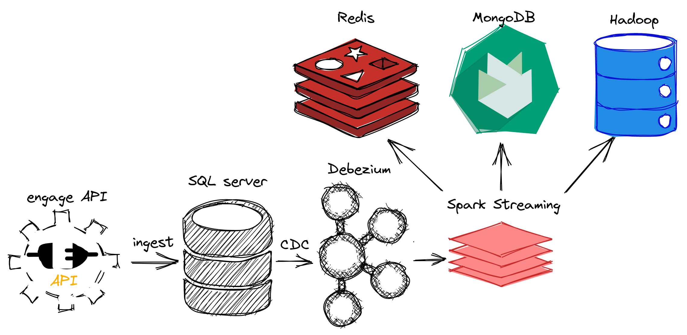
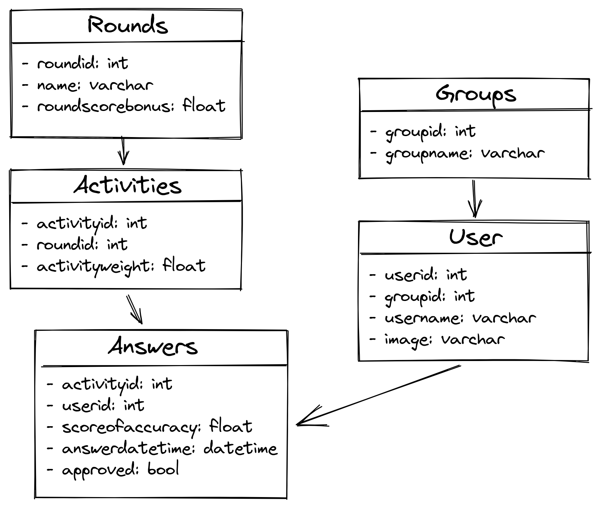

# Engage Challenge

<p>


</p>

<p align="center">

</p>

This project implements a NoSQL strategy to optimize queries executed on a SQL Server. To do it, the presented architecture was built. A rest API is available as a data source to create our SQL Server replication. The NoSQL databases are populated with data extracted from the SQL Server with Debezium and structured with Spark. In the end, MongoDB is used as main database for the query executions and Redis serve as cache to store the main results. In short:

- Debezium: kafka based solution for CDC monitoring from SQL Server;
- Hadoop: permanent data solution, used to store a data lake;
- MongoDB: main NoSQL storage for the solution;
- Redis: in memory database used to cache the main query results from MongoDB;
- Spark: used to stream data from Debezium, transform and ingest data in the leafs: Hadoop, MongoDB and Redis;
- SQL Server: data source where transactional data is stored;

In principle, our SQL Server replica is built as the following schema.

<p align="center">

</p>

## How to start

All the code developed is structured in docker containers and docker compose files. As the containers are divided in multiple compose files, the Makefile targets should help to manipulate it.

First of all, `make init` creates the necessary docker requirements. So, to start the containers, `make init` should be run first. Implicitly it is already called before `storage`, `debezium`, `streaming` and `all` targets. In example, to start only the storage containers such as Hadoop, SQL Server, Redis and MongoDB:

```shell
make storage
```

To start only the Debezium services such as Kafka, Zookeeper and Debezium Connect:

```shell
make debezium
```

To start only the Spark jobs such as Hadoop, MongoDB and Redis ingestions:

```shell
make streaming
```

To start all the containers:

```shell
make all

# to stop them
make stop
```
